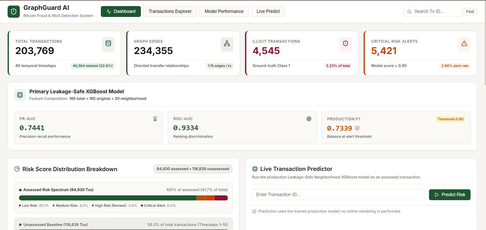
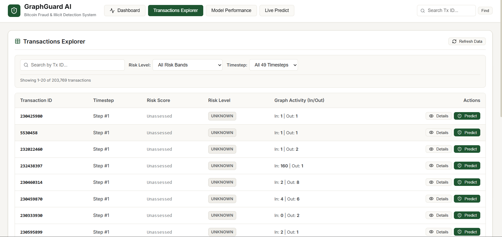
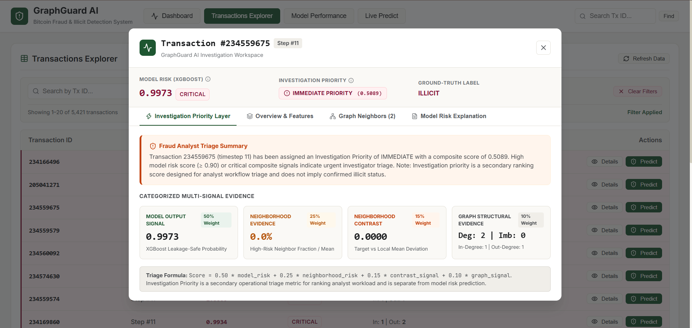
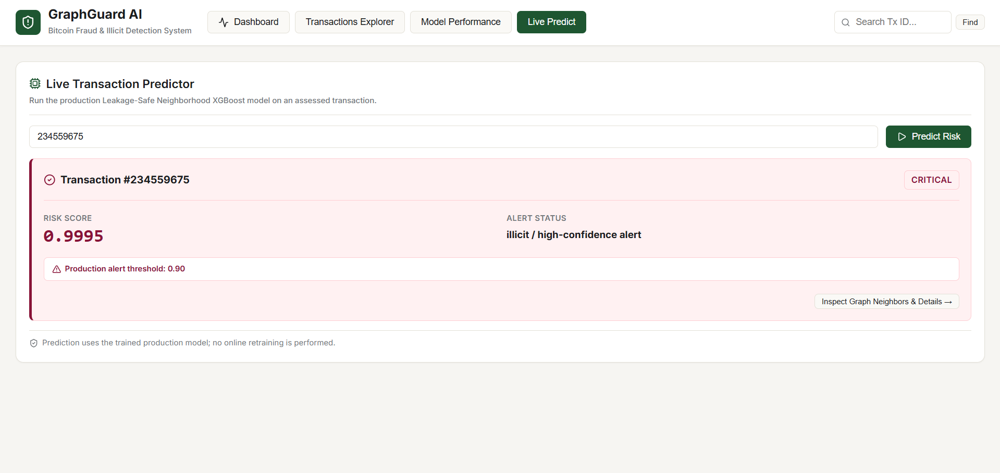

# GraphGuard AI — Bitcoin Transaction Fraud & Illicit Entity Detection System

[](https://www.python.org/)
[](https://fastapi.tiangolo.com/)
[](https://pyg.org/)
[](https://xgboost.readthedocs.io/)
[](https://react.dev/)
[](LICENSE)

**GraphGuard AI** is an end-to-end machine learning system designed to detect illicit Bitcoin transactions and fraudulent entities across multi-hop transaction networks. Built on the **Elliptic Bitcoin Dataset** (203,769 transactions, 234,355 directed edges across 49 temporal timesteps), GraphGuard AI combines temporal graph feature engineering, leakage-safe neighborhood risk modeling, an explainable fraud investigation priority layer, a production-style FastAPI backend, and a modern React/TypeScript dashboard.

---

## 🎯 Key Metrics & Project Performance

All evaluation metrics are computed on a **strict temporal test set** (timesteps 40–49, 11,184 transactions) to reflect real-world financial deployment conditions:

- **Primary Production Model**: Leakage-Safe Neighborhood XGBoost (185 features)
- **Test PR-AUC**: **0.7441** (vs. 0.6738 baseline feature-only XGBoost — **+10.4% relative gain**)
- **Test ROC-AUC**: **0.9334**
- **Recommended Production Alert Threshold**: **0.90**
- **Precision at Threshold 0.90**: **97.15%** (Only 11 false positives out of 386 alerts)
- **Recall at Threshold 0.90**: **58.96%**
- **F1 Score at Threshold 0.90**: **0.7339**
- **Investigation Priority (`IMMEDIATE` Tier)**: **98.10% illicit precision** on temporal test set
- **Backend Architecture**: Indexed in-memory transaction and graph lookups with startup data loading

---

## 💡 Why This Project is Different

1. **Strict Temporal Validation (Zero Future Data Leakage)**: Traditional financial machine learning projects often apply random k-fold cross-validation on graph nodes, which causes severe temporal target leakage. GraphGuard AI strictly evaluates on future timesteps (Train: timesteps 1–34, Validation: 35–39, Test: 40–49).
2. **Leakage-Safe Neighborhood Risk Modeling**: Graph neural networks and neighborhood aggregations often suffer from label leakage during training. GraphGuard AI computes out-of-fold neighborhood risk predictions across historical training folds, preventing target leakage while capturing multi-hop transaction contamination.
3. **Decoupled Secondary Triage Layer**: Rather than making false claims that a manual weighted formula is a "scientifically optimal risk score", GraphGuard AI maintains a clear distinction between the trained XGBoost risk probability and the operational **Investigation Priority Layer** (`IMMEDIATE`, `HIGH`, `REVIEW`, `LOW`) built for fraud analyst workflow triage.
4. **End-to-End Full-Stack Implementation**: Features a production-style FastAPI backend loading datasets into memory at startup with fast indexed lookups, paired with a React/TypeScript interface adhering to a light professional visual theme. Zero mock data.

---

## 🏗️ System Architecture

```
                                 GRAPHGUARD AI ARCHITECTURE

  [ Elliptic Bitcoin Dataset ] ──► [ Feature Engineering ] ──► [ Leakage-Safe Neighborhood Risk ]
    • 203,769 Transactions           • 165 Local/Agg Features    • 20 Out-of-Fold Risk Statistics
    • 234,355 Graph Edges            • 15 Graph Topologies       • Temporal Folds 1-34
    • 49 Temporal Timesteps
                                                                            │
                                                                            ▼
  ┌─────────────────────────────────────────────────────────────────────────┴────────────────┐
  │                           Leakage-Safe Neighborhood XGBoost Model                        │
  │                            (185 Features | Test PR-AUC: 0.7441)                          │
  └─────────────────────────────────────────┬────────────────────────────────────────────────┘
                                            │
                                            ▼
  ┌──────────────────────────────────────────────────────────────────────────────────────────┐
  │                         FastAPI Backend Service (Port 8001)                              │
  │   • In-Memory Indexing                        • Investigation Priority Triage Engine         │
  │   • Real-Time XGBoost Inference                 • 12 Production REST Endpoints           │
  └─────────────────────────────────────────┬────────────────────────────────────────────────┘
                                            │
                                            ▼
  ┌──────────────────────────────────────────────────────────────────────────────────────────┐
  │                  React 19 + TypeScript Investigator Dashboard (Port 5173)                │
  │   • Dashboard Overview & Risk Distribution   • Real-Time XGBoost Risk Predictor          │
  │   • Paginated Transaction Explorer Table     • Graph Neighbors & Risk Evidence Drawer    │
  └──────────────────────────────────────────────────────────────────────────────────────────┘
```

---

## 🖥️ Application Screenshots

### Dashboard



### Transactions Explorer



### Transaction Investigation



### Live Risk Prediction



---

## 📊 Dataset Overview

The dataset originates from the **Elliptic Bitcoin Dataset**, a labeled Bitcoin transaction graph widely used for illicit transaction research:

- **Total Transactions**: 203,769 nodes
- **Total Directed Edges**: 234,355 graph edges representing Bitcoin payment flows
- **Original Features**: 165 features per transaction (94 local transaction features such as fee/time/degree, 71 aggregated step-neighbor features)
- **Labeled Transactions**: 46,564 transactions
  - **Class 1 (Illicit)**: 4,545 transactions (Ransomware, scams, darknet markets, ponzi schemes)
  - **Class 2 (Licit)**: 42,019 transactions (Exchanges, miners, wallet providers, merchant services)
- **Unlabeled Transactions**: 157,205 transactions (`unknown` class)
- **Temporal Timesteps**: 49 sequential timesteps (each timestep represents a discrete ~2-week period of Bitcoin blockchain activity)

---

## 🔬 Machine Learning Pipeline & Progress

The ML pipeline was developed across 6 rigorous experimental phases:

```
  Phase 1: EDA & Graph Engineering ──► Phase 2: Baselines ──► Phase 3: Graph Neural Networks (GraphSAGE)
                                                                             │
  Phase 6: Priority Layer ◄── Phase 5: Leakage-Safe XGBoost ◄── Phase 4: Graph-Enhanced XGBoost
```

### Phase 1 — Feature Engineering & Graph Topology
Computed 15 structural graph features per node from the directed transaction graph: `in_degree`, `out_degree`, `total_degree`, `degree_imbalance`, `absolute_degree_imbalance`, `unique_in_neighbors`, `unique_out_neighbors`, `unique_neighbors`, `has_incoming`, `has_outgoing`, `is_source`, `is_sink`, `is_isolated`, `in_degree_ratio`, `out_degree_ratio`.

### Phase 2 — Baseline ML Models
Trained baseline classifiers using only the 165 original features:
- **Logistic Regression**: Test PR-AUC `0.2189`, ROC-AUC `0.8525`, F1 `0.2529`
- **Feature-Only XGBoost**: Test PR-AUC `0.6738`, ROC-AUC `0.8839`, F1 `0.6743`

### Phase 3 — Graph Neural Networks (GraphSAGE)
Trained a 2-layer GraphSAGE GNN in PyTorch Geometric on the transaction graph:
- **GraphSAGE GNN**: Test PR-AUC `0.4296`, ROC-AUC `0.8341`, F1 `0.2397`
- *Insight*: Standard GNN message passing struggled on the test set due to dynamic temporal evolution and high proportion of unlabeled nodes across timesteps.

### Phase 4 — Graph-Enhanced XGBoost
Combined original 165 features with 15 graph structural features (180 features total):
- **Graph-Enhanced XGBoost**: Test PR-AUC `0.6756`, ROC-AUC `0.8884`, F1 `0.6696`

### Phase 5 — Primary Production Model: Leakage-Safe Neighborhood XGBoost
To capture graph contamination without target leakage, historical out-of-fold risk predictions were computed across temporal folds (Folds 1-15, 1-20, 1-27, 1-34). Generated 20 leakage-safe neighborhood risk features (`model_risk`, `incoming_mean_risk`, `incoming_max_risk`, `incoming_median_risk`, `outgoing_mean_risk`, `neighborhood_mean_risk`, `high_risk_neighbor_fraction`, `neighborhood_vs_self_risk`, etc.):
- **Leakage-Safe Neighborhood XGBoost (185 Features)**:
  - **Test PR-AUC**: **0.7441** (**+10.4% relative gain over baseline**)
  - **Test ROC-AUC**: **0.9334**
  - **Test F1 at threshold 0.50**: **0.7234**
  - **Production F1 at threshold 0.90**: **0.7339**

---

## 📈 Model Performance & Threshold Comparison

| Model Architecture | Features | Test PR-AUC | Test ROC-AUC | Test F1 | Key Advantage / Characteristics |
| :--- | :---: | :---: | :---: | :---: | :--- |
| **Logistic Regression** | 165 | 0.2189 | 0.8525 | 0.2529 | Linear baseline |
| **GraphSAGE GNN** | Graph | 0.4296 | 0.8341 | 0.2397 | 2-layer PyTorch Geometric GNN |
| **Feature-Only XGBoost** | 165 | 0.6738 | 0.8839 | 0.6743 | Non-linear baseline |
| **Graph-Enhanced XGBoost** | 180 | 0.6756 | 0.8884 | 0.6696 | Added 15 graph structural features |
| **Leakage-Safe Neighborhood XGBoost** | **185** | **0.7441** | **0.9334** | **0.7339** | **Primary Production Model (F1 at threshold 0.90; F1 is 0.7234 at 0.50)** |

### Production Threshold Analysis (Threshold 0.90)

A comprehensive threshold sweep was evaluated on the temporal test set (timesteps 40–49) to optimize operational efficiency for financial compliance teams:

```
  Threshold 0.50: Precision = 87.87%, Recall = 61.48%, Alert Count = 445, False Positives = 54 (F1 = 0.7234)
  Threshold 0.90: Precision = 97.15%, Recall = 58.96%, Alert Count = 386, False Positives = 11 (F1 = 0.7339) <-- PRODUCTION CHOICE
  Threshold 0.95: Precision = 97.88%, Recall = 58.02%, Alert Count = 377, False Positives = 8
```

> **Why Threshold 0.90?**
> Setting the alert threshold to 0.90 achieves a **97.15% Precision** rate (F1 Score: **0.7339**) with only **11 false positives** across 11,184 test transactions, reducing compliance officer alert fatigue while capturing nearly 59% of illicit entities.

---

## 🛡️ Phase 6 — Investigation Priority Layer

To support fraud analyst triage without altering the trained probability model, Phase 6 implements a transparent secondary **Investigation Priority Layer**:

$$\text{Investigation Score} = 0.50 \cdot S_{\text{model}} + 0.25 \cdot S_{\text{neigh}} + 0.15 \cdot S_{\text{contrast}} + 0.10 \cdot S_{\text{graph}}$$

### Deterministic Triage Rules
- **`IMMEDIATE`**: $S_{\text{model}} \ge 0.90$ OR ($\text{Score} \ge 0.80$ AND $S_{\text{model}} \ge 0.50$)
- **`HIGH`**: ($0.50 \le S_{\text{model}} < 0.90$) OR ($\text{Score} \ge 0.60$ AND $S_{\text{model}} \ge 0.25$)
- **`REVIEW`**: ($0.25 \le S_{\text{model}} < 0.50$) OR ($\text{Score} \ge 0.45$)
- **`LOW`**: Otherwise ($S_{\text{model}} < 0.25$ AND $\text{Score} < 0.45$)

### Empirical Test Set Triage Breakdown (Timesteps 40–49)

| Priority Category | Transaction Count | % of Test Set | Labeled Count | Illicit Count | Illicit Precision Rate |
| :--- | :--- | :--- | :--- | :--- | :--- |
| **IMMEDIATE** | 1,923 | 4.12% | 368 | 361 | **98.10%** |
| **HIGH** | 1,878 | 4.03% | 87 | 34 | **39.08%** |
| **REVIEW** | 2,519 | 5.40% | 150 | 37 | **24.67%** |
| **LOW** | 40,327 | 86.45% | 10,579 | 204 | **1.93%** |

*Note: Investigation Priority is explicitly presented as an operational triage ranking tool. It is distinct from the primary XGBoost probability and does not claim PR-AUC improvements over Phase 5.*

---

## ⚡ Backend Architecture (FastAPI)

Built using **FastAPI**, **Uvicorn**, **Pydantic v2**, **pandas**, **numpy**, **joblib**, **scikit-learn**, and **XGBoost**.

### Core Backend Features:
- **Startup Indexing**: Loads the raw feature file, graph edgelists, and model artifacts once at application startup. Indexed in-memory transaction and graph structures are constructed at startup to avoid repeated CSV scans during API requests.
- **Zero Retraining in API**: API requests do not trigger online retraining or repeated CSV file scans.
- **Port 8001 Production Binding**: Operates cleanly on port 8001 with CORS configuration.

---

## 🎨 Frontend Architecture (React 19 + TypeScript)

Built using **React 19**, **Vite**, **TypeScript**, and **Lucide React** icons.

### Light Professional Design System:
- **Surfaces**: White (`#ffffff`), warm-gray (`#faf9f6`, `#f0eee9`, `#e6e3da`).
- **Typography**: Charcoal (`#1a1c1e`, `#45484c`, `#72767a`).
- **Color System for Risk Bands**:
  - `0.00–0.24`: **LOW** (Forest Green `#1e5631`)
  - `0.25–0.49`: **MEDIUM** (Amber `#b45309`)
  - `0.50–0.89`: **HIGH** (Burnt Orange `#c2410c`)
  - `0.90–1.00`: **CRITICAL** (Deep Burgundy `#881337`) (Alert Threshold: `0.90`)
  - **UNASSESSED**: Warm Slate (`#52565a`)
- **Strict Compliance**: Zero black backgrounds, NO blue, NO purple, and NO neon colors.

---

## 🔌 API Endpoints Reference

All endpoints are hosted on `http://127.0.0.1:8001`:

| Method | Endpoint | Description |
| :--- | :--- | :--- |
| `GET` | `/api/health` | Server health readiness and artifact status |
| `GET` | `/api/dashboard` | Real aggregate transaction counts, graph edges, and model metrics |
| `GET` | `/api/transactions` | Paginated transaction explorer with risk, timestep, and search filters |
| `GET` | `/api/transactions/{tx_id}` | Detailed transaction metadata, graph features, and degree topology |
| `GET` | `/api/transactions/{tx_id}/neighbors` | Direct incoming & outgoing graph neighbors from Bitcoin edgelist |
| `GET` | `/api/transactions/{tx_id}/explanation` | Synthesized risk explanation and top model feature importances |
| `GET` | `/api/transactions/{tx_id}/investigation` | Investigation priority score, category (`IMMEDIATE`), and evidence cards |
| `POST` | `/api/predict` | Real-time 185-feature XGBoost inference for target `tx_id` (Returns 422 for T1-10) |
| `GET` | `/api/model/metrics` | Model evaluation metrics (PR-AUC, ROC-AUC, F1, threshold analysis) |
| `GET` | `/api/model/feature-importance` | Top feature importance ranking table (supports `limit` param) |
| `GET` | `/api/timesteps` | Per-timestep transaction and label statistics (timesteps 1 to 49) |
| `GET` | `/api/risk-distribution` | Risk score distribution counts and range boundaries |

---

## 📁 Project Structure

```
GraphGuard-AI/
├── backend/
│   ├── app/
│   │   ├── __init__.py
│   │   ├── main.py                    # FastAPI application & route handlers
│   │   ├── config.py                  # Settings, file paths & thresholds
│   │   ├── schemas.py                 # Pydantic v2 data models
│   │   └── services/
│   │       ├── data_service.py        # Startup loader & indexed DataFrames
│   │       ├── model_service.py       # XGBoost inference service
│   │       ├── graph_service.py       # Graph neighbor traversal
│   │       ├── explanation_service.py # Feature importance & evidence synthesizer
│   │       ├── dashboard_service.py   # Aggregate statistics collector
│   │       └── investigation_service.py # Investigation priority engine (Phase 6)
│   ├── requirements.txt
│   └── README.md
├── frontend/
│   ├── src/
│   │   ├── api/
│   │   │   └── client.ts              # API client targeting http://127.0.0.1:8001
│   │   ├── components/
│   │   │   ├── Header.tsx             # Brand header and global transaction search
│   │   │   ├── DashboardOverview.tsx  # Summary cards & key indicators
│   │   │   ├── RiskDistributionCard.tsx # Risk score distribution chart
│   │   │   ├── ModelPerformanceCard.tsx # PR-AUC, ROC-AUC & feature importances
│   │   │   ├── TimestepTrendCard.tsx  # 49-timestep volume trend chart
│   │   │   ├── TransactionTable.tsx   # Paginated transaction explorer
│   │   │   ├── PredictForm.tsx        # Real-time XGBoost risk predictor
│   │   │   ├── TransactionDetailModal.tsx # Inspection drawer & graph neighbor list
│   │   │   └── InvestigationPriorityBadge.tsx # Priority badge component
│   │   ├── types/
│   │   │   └── api.ts                 # TypeScript data contracts
│   │   ├── App.tsx
│   │   ├── main.tsx
│   │   └── index.css                  # Light warm-gray design system tokens
│   ├── package.json
│   └── vite.config.ts
├── data/
│   └── raw/                           # Raw Elliptic CSVs (excluded from git tracking)
├── src/
│   ├── graph_feature_engineering.py   # Phase 1 script
│   ├── train_xgboost.py               # Phase 2 script
│   ├── train_graphsage.py             # Phase 3 script
│   ├── train_graph_xgboost.py         # Phase 4 script
│   ├── train_neighborhood_xgboost.py  # Phase 5 script
│   └── investigation_priority_analysis.py # Phase 6 evaluation script
├── outputs/                           # Evaluation JSONs, CSV summaries & joblib models
├── .gitignore                         # Configured git exclusions
└── README.md                          # Root project documentation
```

---

## 🛠️ Installation & Setup

### Prerequisites
- Windows 10/11 (or Linux/macOS)
- Python 3.11.9
- Node.js 18+ & npm

### 1. Clone Repository & Setup Virtual Environment
```bash
git clone https://github.com/akshat568/GraphGuard-AI.git
cd GraphGuard-AI
python -m venv .venv
.venv\Scripts\activate
```

### 2. Install Backend Dependencies
```bash
pip install -r backend/requirements.txt
```

### 3. Install Frontend Dependencies
```bash
cd frontend
npm install
cd ..
```

---

## 🚀 Running the Application

### 1. Run FastAPI Backend Server (Port 8001)
From project root:
```bash
.venv\Scripts\python.exe -m uvicorn backend.app.main:app --host 127.0.0.1 --port 8001
```
- **Backend API**: `http://127.0.0.1:8001`
- **Swagger Docs**: `http://127.0.0.1:8001/docs`

### 2. Run React Frontend Dashboard (Port 5173)
From `frontend/` directory:
```bash
cd frontend
npm run dev
```
- **Dashboard UI**: `http://localhost:5173`

---

## 🧪 Testing & Verification

### Automated Backend Test Suite
Run end-to-end API test verification against the running server:
```bash
.venv\Scripts\python.exe backend/test_backend.py
```
*Expected Output: `Passed 12 / 12 tests.`*

### Phase 6 Priority Layer Evaluation
Run test set evaluation across timesteps 40–49:
```bash
.venv\Scripts\python.exe src/investigation_priority_analysis.py
```

---

## ⚠️ Limitations

- **Probabilistic Prediction**: Model risk scores predict statistical probability based on graph topology and transaction features. Risk scores do not constitute legal proof of criminal activity.
- **Timesteps 1–10 Unpredicted**: Precomputed leakage-safe neighborhood features are unavailable for historical timesteps 1–10 due to historical fold constraints. Requests for these timesteps return a clear HTTP 422 restriction.

---

## 🔮 Future Improvements

- **Streaming Dynamic Graph Updates**: Implement online graph feature updates using streaming message queues (Apache Kafka) for real-time mempool transaction scoring.
- **Temporal Dynamic GNNs**: Explore Temporal Graph Networks (TGN) or DySAT for multi-timestep edge representation learning.
- **Multi-Chain Expansion**: Extend graph feature engineering pipelines to Ethereum and EVM-compatible account-based blockchains.

---

## 📝 Resume-Ready Project Summary

**GraphGuard AI — Bitcoin Transaction Fraud & Illicit Entity Detection System**
*Key Skills: Python, PyTorch Geometric, XGBoost, FastAPI, React, TypeScript, Graph Feature Engineering, Machine Learning Systems, Model Evaluation*

- Engineered a graph machine learning system on **203,769 Bitcoin transactions** and **234,355 directed edges** across 49 temporal timesteps.
- Developed a **Leakage-Safe Neighborhood XGBoost** model using 185 features, achieving **0.7441 Test PR-AUC** (+10.4% relative gain over baseline) and **0.9334 ROC-AUC** under strict temporal validation.
- Calibrated a production alert threshold (0.90) delivering **97.15% Precision** with only 11 false positives across 11,184 test transactions.
- Designed an explainable **Investigation Priority Layer** concentrating **98.10% illicit precision** in the top `IMMEDIATE` priority tier for compliance analyst triage.
- Built a FastAPI backend with indexed in-memory transaction and graph structures for efficient API lookups, paired with a React 19 / TypeScript dashboard.
